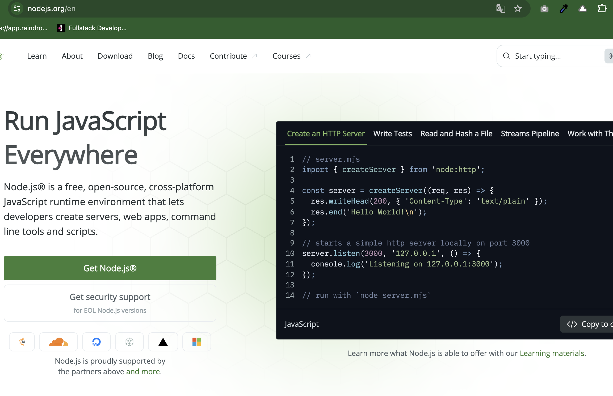
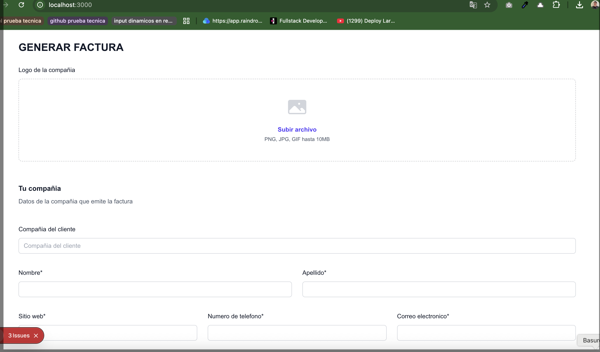

# INSTALL Frontend Invoice

## Prerequisites
Download and install Node.js >= 24.14.0 and pnpm >= 10.30.3

https://nodejs.org/en



## Installation Steps

1. Clone the repository:
```bash
git clone https://github.com/go0hum/invoice-front.git
cd "invoice-front"
```

2. Install dependencies:
```bash
pnpm install
```

3. Run the development server:
```bash
pnpm dev
```

You can see like this:



Later you can see the site in the URL:

http://localhost:3000


You can see in production in the url 

https://invoice-front-a76zx0441-1201hs-projects.vercel.app/